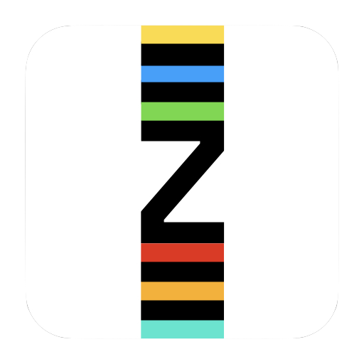

 

<h1 align="center" >spikze.club</h1>

 

This repository contains all code to power [spikze.club](https://spikze.club), a digital scoreboard to keep track of local dart matches with your guys and gals. If you like somehting on spikez.club, feel free to look around how things were implemented.

Please also note: this is a personal side project, hence it's basically the Wild West when it comes to CI/CD, testing and code quality. Not that I expect any issues/PRs, but it should be mentioned nevertheless.

## Stack

- Svelte
- SvelteKit
- Cloudflare Pages (Hosting)
- Gitpod (IDE)

[MIT License](https://opensource.org/licenses/MIT)
